<!-- README.md is generated from README.Rmd. Please edit that file -->
killedbypolice
==============

<!--
[](https://github.com/benmarwick/killedbypolice/commits/master)  
[](https://travis-ci.org/benmarwick/killedbypolice)   [](https://img.shields.io/badge/lifecycle-experimental-orange.svg)
-->
The goal of killedbypolice is to make readily available the data collected by <http://killedbypolice.net/> for exploration, visualisation, and analysis.

We don't know much about who collects the data for <http://killedbypolice.net/>, or what their methods are. [FiveThirtyEight](https://fivethirtyeight.com/features/another-much-higher-count-of-police-homicides/) reported that he was 'an instructor on nonviolent physical-intervention techniques and that he prefers to remain anonymous'.

This is an important data set because the 'US government has no comprehensive record of the number of people killed by law enforcement.' ([*The Guardian*, 1 June 2015](https://www.theguardian.com/us-news/ng-interactive/2015/jun/01/about-the-counted)). The killedbypolice project is one of a few non-government projects that continuously collect data on police killings (see [Related work](#related-work) below).

Installation
------------

You can install killedbypolice from github with:

``` r
# install.packages("devtools")
devtools::install_github("benmarwick/killedbypolice")
```

How to use
----------

This is a basic example which shows you how to access the data in this package:

``` r
# load the library
library(killedbypolice)

# load the data frame, ready to work with 
data("kbp2013_2017")
```

Here are some ways we can take a look at the structure of the data:

``` r
# inspect the data
suppressPackageStartupMessages(library(dplyr))
glimpse(kbp2013_2017)
#> Observations: 5,578
#> Variables: 13
#> $ state          <chr> "WA", "CA", "NC", "PA", "CA", "CO", "CA", "LA",...
#> $ name           <chr> "James M. Eshelman", "Dontae Hayes", "Ricky Jun...
#> $ age            <dbl> 54, 20, 34, 43, 31, 43, 45, 22, 30, 51, 37, 40,...
#> $ gender         <chr> "M", "M", "M", "M", "F", "M", "M", "M", "M", "M...
#> $ race_ethnicity <chr> NA, "B", "B", "B", "W", "W", "O", NA, "W", "W",...
#> $ method_1       <chr> "G", "G", "G", "G", "G", "G", "G", "G", "G", "G...
#> $ method_2       <chr> NA, NA, NA, NA, NA, NA, NA, NA, NA, NA, NA, NA,...
#> $ method_3       <chr> NA, NA, NA, NA, NA, NA, NA, NA, NA, NA, NA, NA,...
#> $ method_4       <chr> NA, NA, NA, NA, NA, NA, NA, NA, NA, NA, NA, NA,...
#> $ method_5       <chr> NA, NA, NA, NA, NA, NA, NA, NA, NA, NA, NA, NA,...
#> $ event_year     <dbl> 2013, 2013, 2013, 2013, 2013, 2013, 2013, 2013,...
#> $ event_month    <dbl> 12, 12, 12, 12, 12, 12, 12, 12, 12, 12, 12, 12,...
#> $ event_day      <int> 31, 31, 31, 30, 30, 29, 29, 29, 29, 29, 28, 28,...

head(kbp2013_2017)
#> # A tibble: 6 x 13
#>   state name          age gender race_ethnicity method_1 method_2 method_3
#>   <chr> <chr>       <dbl> <chr>  <chr>          <chr>    <chr>    <chr>   
#> 1 WA    James M. E~   54. M      <NA>           G        <NA>     <NA>    
#> 2 CA    Dontae Hay~   20. M      B              G        <NA>     <NA>    
#> 3 NC    Ricky Juni~   34. M      B              G        <NA>     <NA>    
#> 4 PA    William Ja~   43. M      B              G        <NA>     <NA>    
#> 5 CA    Bethany Ly~   31. F      W              G        <NA>     <NA>    
#> 6 CO    Christophe~   43. M      W              G        <NA>     <NA>    
#> # ... with 5 more variables: method_4 <chr>, method_5 <chr>,
#> #   event_year <dbl>, event_month <dbl>, event_day <int>
```

Some explorations
-----------------

Here are some explorations of the data:

The most common age to be killed by police is in the late twenties and early thirties, and this has not changed much over time.

``` r
library(ggplot2)
library(ggridges)

kbp2013_2017 %>% 
  filter(gender %in% c("F", "M", "T")) %>% 
  filter(!is.na(event_year)) %>% 
  ggplot(aes(x = age,
             y = factor(event_year),
             fill = gender)) +
  geom_density_ridges(alpha = 0.5, 
                      scale = 0.9)  +
  theme_ridges(font_size = 10) +
  scale_x_continuous(breaks = seq(0, 100, 10),
                     labels = seq(0, 100, 10)) +
  xlab("Age at death (years)") +
  ylab("Year") +
  theme(axis.title = element_text(size = 14))
```

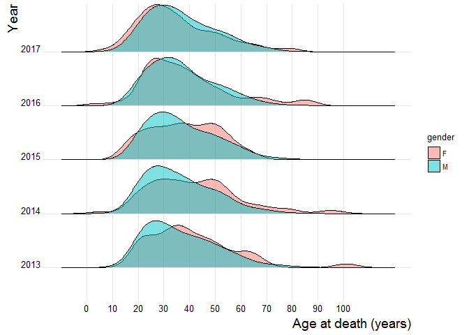

Of the three ethnic groups that make up most of the deaths, Black and Latino people tend to be younger than White people when they are killed by police.

``` r
kbp2013_2017 %>% 
  filter(race_ethnicity %in% c("B", "W", "L")) %>% 
  filter(!is.na(event_year)) %>% 
  ggplot(aes(x = age,
             y = factor(event_year),
             fill = race_ethnicity)) +
  geom_density_ridges(alpha = 0.6, 
                      scale = 0.9)  +
  theme_ridges(font_size = 10) +
  scale_x_continuous(breaks = seq(0, 100, 10),
                     labels = seq(0, 100, 10)) +
  xlab("Age at death (years)") +
  ylab("Year") +
  theme(axis.title = element_text(size = 14))
```

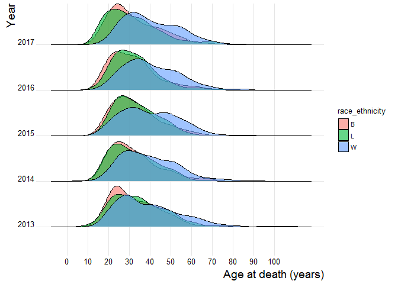

By far the most common way that people are killed by police is with a gun. Deaths by vehicle involve women more often than men.

``` r
kbp2013_2017 %>% 
  filter(!is.na(event_year)) %>% 
  filter(method_1 != "NA") %>% 
  filter(gender %in% c("M", "F", "T")) %>% 
  group_by(event_year, 
           gender,
           method_1) %>% 
  tally() %>% 
  mutate(perc = n / sum(n) * 100)  %>% 
  ggplot(aes(method_1,
             perc,
             fill = gender)) +
  geom_col() +
  facet_grid(gender~event_year) +
  theme_minimal(base_size = 14) +
  xlab("Method of killing") +
  ylab("Percentage of all\npeople killed by police\nby gender") 
```

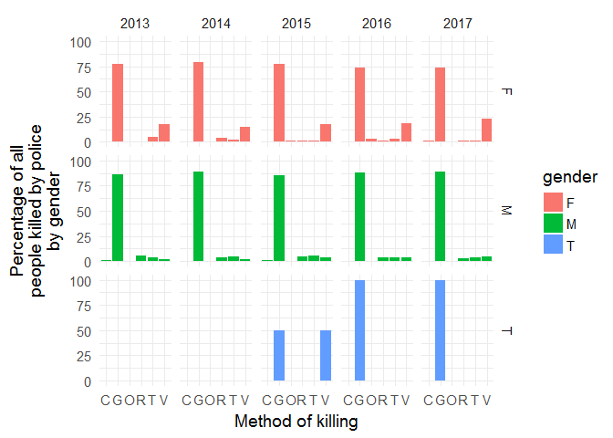

In 2016, the state with the largest number of people killed by police was California.

``` r
library(statebins) # using GitHub version
library(viridis)

# we need to convert state abbreviations to state names for the statebins function
state_abb <- data_frame(state_name = state.name,
                        state_abb = state.abb)

# we need to add the state popluations so we can get a proportion of people in each state
# we got this from https://www2.census.gov/programs-surveys/popest/tables/2010-2016/state/totals/nst-est2016-01.xlsx
state_populations <- readr::read_csv("data-raw/nst-est2016-01.csv")

# clean it a little
state_populations <-  
  state_populations %>% 
  mutate(state_name = gsub("\\.", "", X__1)) %>%
  left_join(state_abb)

# compute deaths by state and as deaths per 1000 people in each state
by_state <- kbp2013_2017 %>% 
  filter(event_year == 2016) %>% 
  group_by(state) %>% 
  tally() %>% 
  left_join(state_abb, by = c('state' = 'state_abb')) %>% 
  filter(!is.na(state_name)) %>% 
  left_join(state_populations) %>% 
  mutate(per_n_people = (n / `2016`) * 1000000)

# plot 'statebin' style map
ggplot(by_state, 
       aes(state = state_name, 
           fill = n)) +
  geom_statebins() +
  coord_equal() +
  scale_fill_viridis() +
  theme_statebins() +
  labs(title = "Total number of people killed by police in each state in 2016") +
  theme(legend.title=element_blank()) 
```

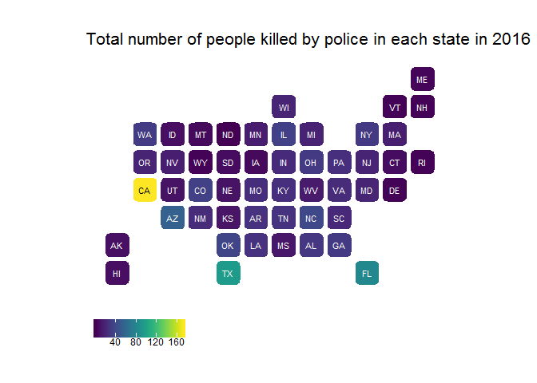

But when we consider the differences in the number of people in each state, New Mexico and Alaska have the highest proportions of people killed by police.

``` r
ggplot(by_state, 
       aes(state = state_name, 
           fill = per_n_people)) +
  geom_statebins() +
  coord_equal() +
  scale_fill_viridis() +
  theme_statebins() +
  labs(title = "Number of people killed by police in each state in 2016,\nper 1,000,000 people")  +
  theme(legend.title=element_blank()) 
```

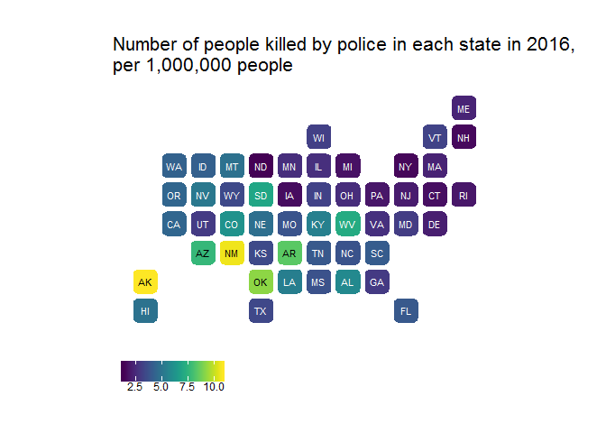

There does not appear to any obvious seasonality to police killings. June 2013 and July 2015 were especially bad months.

``` r
kbp2013_2017 %>% 
  filter(!is.na(event_month)) %>% 
  group_by(event_month, 
           event_year) %>% 
  tally() %>% 
  mutate(month_name = month.abb[event_month]) %>% 
  mutate(month_name = factor(month_name, levels = month.abb)) %>% 
ggplot() +
  geom_tile(aes(x = month_name, 
                y = event_year, 
                fill = n)) +
  scale_fill_viridis_c() +
  theme_minimal() +
  xlab("Month") +
  ylab("Year")
```

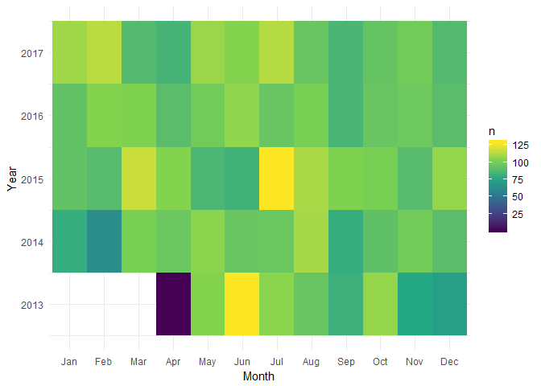

Have any states seen strong upward or downward trends over time? It's difficult to see if we plot them all, so let's search for states with strong trends.

``` r
n_over_time_by_state <- 
kbp2013_2017 %>% 
  group_by(state,
           event_year) %>% 
  tally() %>% 
  ungroup()

ggplot(n_over_time_by_state,
       aes(event_year,
           n,
           colour = state)) +
  geom_line() +
  geom_text(data = n_over_time_by_state[n_over_time_by_state$n > 50 & n_over_time_by_state$event_year == 2017,],
           aes(label = state,
               x = 2017.1, 
               y = n, 
               colour = state, 
               hjust = -.01)) +
  theme_minimal()  +
  ylab("Number of people killed by police") +
  xlab("Year") +
  theme(legend.position="none")
```

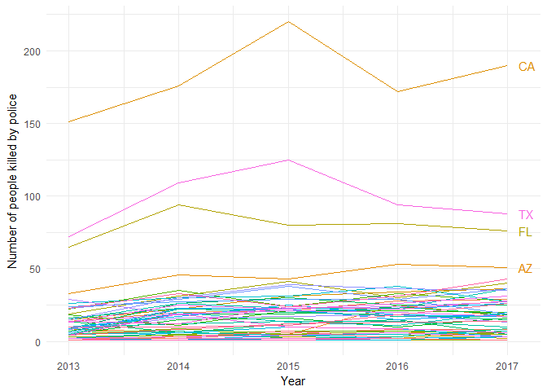

Let's compute a linear model for the number of killings and years for each state, then see which states have the most extreme trends. We can used a nested data frame to do this efficiently (based on the example in Grolemund and Wickham's book [*R for Data Science*](http://r4ds.had.co.nz/many-models.html)):

``` r
library(tidyr)
nested_df <- 
n_over_time_by_state %>% 
  filter(state != "") %>% 
  filter(!is.na(event_year)) %>% 
  nest(-state)
```

Which looks like this:

``` r
head(nested_df)
#> # A tibble: 6 x 2
#>   state data            
#>   <chr> <list>          
#> 1 AK    <tibble [5 x 2]>
#> 2 AL    <tibble [5 x 2]>
#> 3 AR    <tibble [5 x 2]>
#> 4 AZ    <tibble [5 x 2]>
#> 5 CA    <tibble [5 x 2]>
#> 6 CO    <tibble [5 x 2]>
```

And the *tibble* that we see in each row looks something like this:

``` r
nested_df$data[1]
#> [[1]]
#> # A tibble: 5 x 2
#>   event_year     n
#>        <dbl> <int>
#> 1      2013.     2
#> 2      2014.     2
#> 3      2015.     6
#> 4      2016.     8
#> 5      2017.     8
```

Now let's compute linear models for all states:

``` r
library(purrr)
model_by_state <- 
nested_df %>% 
  mutate(model = map(data, ~lm(event_year ~ n, data = .)))
```

Let's only look at the states where the linear model has a p-value of less than 0.05 and the adjusted R<sup>2</sup> is &gt;0.7. This will limit us to states that have a statistically significant trend over time:

``` r
glance <- model_by_state %>% 
  mutate(glance = map(model, broom::glance)) %>% 
  unnest(glance, .drop = TRUE)

glance_sig <- 
  glance %>% 
  filter(adj.r.squared >= 0.7) %>% 
  filter(p.value <= 0.05) %>% 
  arrange(desc(adj.r.squared))

glance_sig
#> # A tibble: 7 x 12
#>   state r.squared adj.r.squared sigma statistic p.value    df logLik   AIC
#>   <chr>     <dbl>         <dbl> <dbl>     <dbl>   <dbl> <int>  <dbl> <dbl>
#> 1 AL        0.943         0.923 0.438      49.2 0.00595     2  -1.69  9.37
#> 2 CO        0.931         0.908 0.479      40.5 0.00785     2  -2.14 10.3 
#> 3 WV        0.908         0.878 0.552      29.8 0.0121      2  -2.85 11.7 
#> 4 AK        0.880         0.841 0.631      22.1 0.0182      2  -3.52 13.0 
#> 5 NM        0.849         0.799 0.709      16.9 0.0261      2  -4.10 14.2 
#> 6 WI        0.816         0.755 0.782      13.3 0.0355      2  -4.59 15.2 
#> 7 VA        0.785         0.713 0.847      10.9 0.0455      2  -4.99 16.0 
#> # ... with 3 more variables: BIC <dbl>, deviance <dbl>, df.residual <int>
```

And when we plot only these states with the signficant trends we see that they all indicate a trend of *increasing* deaths by police over time.

No state seems to have succeeded in reducing the total number of people killed by police over time.

``` r
n_over_time_by_state_sig <- 
n_over_time_by_state %>% 
  filter(state %in% glance_sig$state) 

ggplot(n_over_time_by_state_sig,
       aes(event_year,
           n,
           group = state,
           colour = state)) +
  geom_line() +
  geom_text(data = n_over_time_by_state_sig[ n_over_time_by_state_sig$event_year == 2017,],
           aes(label = state,
               x = 2017.1, 
               y = n, 
               colour = state, 
               hjust = -.01)) +
  theme_minimal() +
  ylab("Number of people killed by police") +
  xlab("Year")
```

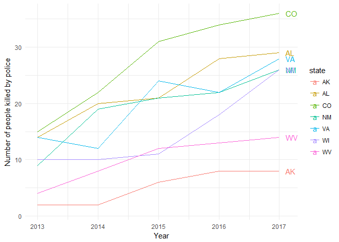

How do the states cluster with each other? To identify states with a similar history of fatalities from police violence, we can apply cluster analysis. We can do this in several ways, for example by summary attributes for each state (combining all years), or by the time series.

Here is the cluster analysis using the summary attributes for each state. In particular we cluster using the variables of mean age at death, proportion male, proportion Black, and proportion killed by guns.

``` r
kbp2013_2017_ppl <- 
  kbp2013_2017 %>% 
  select(state,
         age, 
         gender,
         race_ethnicity,
         method_1) %>% 
  group_by(state) %>% 
  summarise(mean_age =   mean(age, na.rm = TRUE),
            prop_male =  sum(gender == "M") / n(),
            prop_black = sum(race_ethnicity == "B",
                             na.rm = TRUE) / n(),
            prop_g =     sum(method_1 == "G") / n())

library(cluster)
gower_dist <- daisy(kbp2013_2017_ppl[, -1],
                    metric = "gower")

sil_width <- vector()

for(i in 2:10){
  
  pam_fit <- pam(gower_dist,
                 diss = TRUE,
                 k = i)
  
  sil_width[i] <- pam_fit$silinfo$avg.width
  
}

# Plot sihouette width (higher is better)

plot(1:10, sil_width,
     xlab = "Number of clusters",
     ylab = "Silhouette Width")
lines(1:10, sil_width)
```

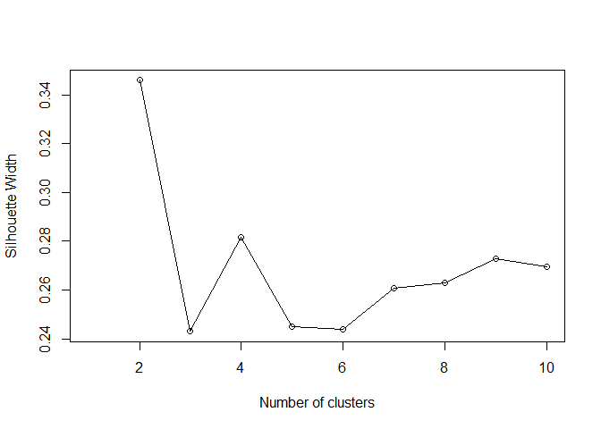

It looks like four clusters are a good fit for these data.

``` r
pam_fit <- pam(gower_dist, diss = TRUE, k = 4)

library(ggfortify)

# compute PCA
kbp2013_2017_ppl_pca <- 
kbp2013_2017_ppl %>% 
    select(-state) %>% 
    filter(complete.cases(.)) %>% 
    prcomp(., scale = TRUE) 

# to help with plotting
kbp2013_2017_ppl_with_clusters <- 
kbp2013_2017_ppl %>% 
    mutate(cluster = factor(pam_fit$clustering))  %>% 
    filter(complete.cases(.))

# for labels
rownames(kbp2013_2017_ppl_with_clusters) <- 
    kbp2013_2017_ppl_with_clusters$state
    
autoplot(kbp2013_2017_ppl_pca,
                data = kbp2013_2017_ppl_with_clusters, 
                colour = "cluster",
                loadings = TRUE, 
                loadings.colour = 'blue',
                loadings.label = TRUE, 
                loadings.label.size = 3,
                size = 0, 
                label = TRUE,
                frame = TRUE) +
    theme_minimal() +
    coord_equal()
```


We can see that the states strongly cluster by the proportion of Black victims (states with higher proportions on the right on the above plot). Average age of victim also separates the states, and is correlated with the proportion of Black victims. Typically, states with higher proportions of Black victims have a younger average age at the time they were killed. We can see this relationship clearly below:

``` r
ggplot(kbp2013_2017_ppl_with_clusters,
aes(mean_age, 
        prop_black)) +
    geom_text(aes(label = state,
                                colour = cluster)) +
    geom_smooth(method = "lm", 
                            colour = "black") +
    theme_minimal()
```

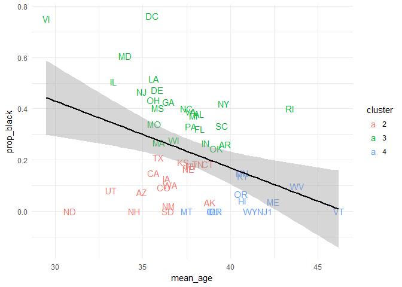

We can also cluster the states using the time series of how many people killed per year. This is useful for identifying when groups of states had change points in their time series of people killed by police.

First we compute the proportion of people killed per million, per state, per year:

``` r
state_populations_long <- 
    state_populations %>% 
    select(`2010`:`2016`, state_abb) %>% 
    gather(year, population, -state_abb) %>% 
    filter(!is.na(state_abb))

kbp2013_2017_props_per_year <- 
kbp2013_2017 %>% 
    nest(-event_year) %>% 
    filter(!is.na(event_year)) %>% 
    mutate(per_cap = map(data, ~.x %>% 
      group_by(state) %>% 
      tally() %>% 
      left_join(state_abb, by = c('state' = 'state_abb')) %>% 
      filter(!is.na(state_name)) %>% 
      left_join(state_populations_long %>% 
                            filter(year == event_year),
                        by = c("state" = "state_abb")) %>% 
      mutate(prop = n / population * 1000000))) %>% 
      unnest(per_cap) %>% 
      filter(!is.na(prop)) %>% 
    arrange(event_year, state)

kbp2013_2017_props_per_year
#> # A tibble: 198 x 7
#>    event_year state     n state_name  year  population  prop
#>         <dbl> <chr> <int> <chr>       <chr>      <dbl> <dbl>
#>  1      2013. AK        2 Alaska      2014     736705.  2.71
#>  2      2013. AL       14 Alabama     2013    4829479.  2.90
#>  3      2013. AR        9 Arkansas    2016    2988248.  3.01
#>  4      2013. AZ       33 Arizona     2015    6817565.  4.84
#>  5      2013. CO       15 Colorado    2013    5267603.  2.85
#>  6      2013. CT        9 Connecticut 2014    3591873.  2.51
#>  7      2013. DE        2 Delaware    2015     944076.  2.12
#>  8      2013. FL       65 Florida     2016   20612439.  3.15
#>  9      2013. HI        3 Hawaii      2013    1406481.  2.13
#> 10      2013. ID        2 Idaho       2014    1633532.  1.22
#> # ... with 188 more rows
```

A widely-used way to cluster time series is shape-based clustering using the Dynamic Time Warping (DTW) distance as dissimilarity measure. We need to try a range of different possible number of clusters to see which number is th e best fit for our data. Here we try 3-30 clusters, and show the output of several cluster validity indices.

``` r
library(dtwclust)
kbp2013_2017_props_per_year_s <- 
kbp2013_2017_props_per_year %>% 
    select(event_year, prop, state) 

# input must be a list
kbp2013_2017_props_per_year_split <- 
  split(kbp2013_2017_props_per_year_s,   
            factor(kbp2013_2017_props_per_year_s$state))

#... with each item a vector
kbp2013_2017_props_per_year_split_num <- 
map(kbp2013_2017_props_per_year_split, 
        ~pull(.x, prop))

# partitional clustering, let's run a bunch of cluster analyses with 
# different number of clusters to see what number is best
n <- 3:35

pck <- tsclust(kbp2013_2017_props_per_year_split_num, 
                            type = "partitional", k = n, 
              distance = "dtw_basic", centroid = "pam", 
              seed = 3247L, trace = TRUE)
#> 
#>  Precomputing distance matrix...
#> 
#> Iteration 1: Changes / Distsum = 40 / 258.5851
#> Iteration 2: Changes / Distsum =  5 / 221.974
#> Iteration 3: Changes / Distsum =  0 / 221.974
#> 
#> Iteration 1: Changes / Distsum = 40 / 246.833
#> Iteration 2: Changes / Distsum = 1 / 214.3287
#> Iteration 3: Changes / Distsum = 0 / 214.3287
#> 
#> Iteration 1: Changes / Distsum = 40 / 222.8264
#> Iteration 2: Changes / Distsum =   5 / 210.31
#> Iteration 3: Changes / Distsum =   0 / 210.31
#> 
#> Iteration 1: Changes / Distsum = 40 / 287.4505
#> Iteration 2: Changes / Distsum = 16 / 197.1026
#> Iteration 3: Changes / Distsum = 4 / 187.3093
#> Iteration 4: Changes / Distsum = 4 / 183.4082
#> Iteration 5: Changes / Distsum = 0 / 183.4082
#> 
#> Iteration 1: Changes / Distsum = 40 / 193.8382
#> Iteration 2: Changes / Distsum =  3 / 163.113
#> Iteration 3: Changes / Distsum =  0 / 163.113
#> 
#> Iteration 1: Changes / Distsum = 40 / 183.6701
#> Iteration 2: Changes / Distsum = 9 / 159.9926
#> Iteration 3: Changes / Distsum = 5 / 152.3392
#> Iteration 4: Changes / Distsum = 0 / 150.9425
#> 
#> Iteration 1: Changes / Distsum = 40 / 182.1236
#> Iteration 2: Changes / Distsum = 10 / 146.9528
#> Iteration 3: Changes / Distsum = 0 / 146.9528
#> 
#> Iteration 1: Changes / Distsum = 40 / 178.5342
#> Iteration 2: Changes / Distsum = 8 / 139.8759
#> Iteration 3: Changes / Distsum = 1 / 136.9635
#> Iteration 4: Changes / Distsum = 0 / 136.9635
#> 
#> Iteration 1: Changes / Distsum = 40 / 160.164
#> Iteration 2: Changes / Distsum = 8 / 145.6118
#> Iteration 3: Changes / Distsum = 4 / 130.4108
#> Iteration 4: Changes / Distsum =  1 / 125.291
#> Iteration 5: Changes / Distsum =  0 / 125.291
#> 
#> Iteration 1: Changes / Distsum = 40 / 130.9427
#> Iteration 2: Changes / Distsum = 4 / 123.3806
#> Iteration 3: Changes / Distsum = 0 / 123.3806
#> 
#> Iteration 1: Changes / Distsum = 40 / 128.9825
#> Iteration 2: Changes / Distsum =  7 / 117.593
#> Iteration 3: Changes / Distsum = 2 / 112.0633
#> Iteration 4: Changes / Distsum = 1 / 109.7906
#> Iteration 5: Changes / Distsum = 0 / 109.7906
#> 
#> Iteration 1: Changes / Distsum = 40 / 124.9841
#> Iteration 2: Changes / Distsum = 6 / 121.2812
#> Iteration 3: Changes / Distsum = 1 / 121.1377
#> Iteration 4: Changes / Distsum = 0 / 121.1377
#> 
#> Iteration 1: Changes / Distsum = 40 / 109.7762
#> Iteration 2: Changes / Distsum = 5 / 101.5831
#> Iteration 3: Changes / Distsum = 0 / 101.5831
#> 
#> Iteration 1: Changes / Distsum = 40 / 123.7524
#> Iteration 2: Changes / Distsum = 3 / 106.8117
#> Iteration 3: Changes / Distsum = 0 / 106.0941
#> 
#> Iteration 1: Changes / Distsum = 40 / 110.4794
#> Iteration 2: Changes / Distsum = 1 / 106.7613
#> Iteration 3: Changes / Distsum = 1 / 104.2214
#> Iteration 4: Changes / Distsum = 0 / 104.2214
#> 
#> Iteration 1: Changes / Distsum = 40 / 94.79757
#> Iteration 2: Changes / Distsum = 5 / 85.22435
#> Iteration 3: Changes / Distsum =  1 / 85.0809
#> Iteration 4: Changes / Distsum =  0 / 85.0809
#> 
#> Iteration 1: Changes / Distsum = 40 / 96.36034
#> Iteration 2: Changes / Distsum =  1 / 96.2019
#> Iteration 3: Changes / Distsum = 1 / 95.93206
#> Iteration 4: Changes / Distsum = 0 / 95.93206
#> 
#> Iteration 1: Changes / Distsum = 40 / 85.33017
#> Iteration 2: Changes / Distsum = 8 / 71.83528
#> Iteration 3: Changes / Distsum = 0 / 71.83528
#> 
#> Iteration 1: Changes / Distsum = 40 / 94.29054
#> Iteration 2: Changes / Distsum = 2 / 84.77621
#> Iteration 3: Changes / Distsum = 1 / 84.61777
#> Iteration 4: Changes / Distsum = 0 / 84.61777
#> 
#> Iteration 1: Changes / Distsum = 40 / 87.24527
#> Iteration 2: Changes / Distsum = 4 / 78.74469
#> Iteration 3: Changes / Distsum = 0 / 78.74469
#> 
#> Iteration 1: Changes / Distsum =  40 / 63.286
#> Iteration 2: Changes / Distsum = 1 / 62.52849
#> Iteration 3: Changes / Distsum = 0 / 62.52849
#> 
#> Iteration 1: Changes / Distsum = 40 / 74.04409
#> Iteration 2: Changes / Distsum = 3 / 68.64559
#> Iteration 3: Changes / Distsum = 0 / 68.64559
#> 
#> Iteration 1: Changes / Distsum = 40 / 65.45499
#> Iteration 2: Changes / Distsum = 0 / 65.45499
#> 
#> Iteration 1: Changes / Distsum = 40 / 65.56188
#> Iteration 2: Changes / Distsum = 0 / 65.56188
#> 
#> Iteration 1: Changes / Distsum = 40 / 57.82321
#> Iteration 2: Changes / Distsum = 4 / 53.87667
#> Iteration 3: Changes / Distsum = 2 / 52.06313
#> Iteration 4: Changes / Distsum = 0 / 52.06313
#> 
#> Iteration 1: Changes / Distsum = 40 / 41.66883
#> Iteration 2: Changes / Distsum = 1 / 40.12514
#> Iteration 3: Changes / Distsum = 0 / 40.12514
#> 
#> Iteration 1: Changes / Distsum = 40 / 37.70246
#> Iteration 2: Changes / Distsum = 2 / 33.48613
#> Iteration 3: Changes / Distsum = 0 / 33.48613
#> 
#> Iteration 1: Changes / Distsum = 40 / 47.36676
#> Iteration 2: Changes / Distsum = 4 / 41.71408
#> Iteration 3: Changes / Distsum = 0 / 41.71408
#> 
#> Iteration 1: Changes / Distsum = 40 / 41.43239
#> Iteration 2: Changes / Distsum = 2 / 36.44346
#> Iteration 3: Changes / Distsum = 0 / 36.44346
#> 
#> Iteration 1: Changes / Distsum = 40 / 25.44446
#> Iteration 2: Changes / Distsum = 1 / 25.17453
#> Iteration 3: Changes / Distsum = 0 / 25.17453
#> 
#> Iteration 1: Changes / Distsum = 40 / 29.03759
#> Iteration 2: Changes / Distsum =  1 / 25.7913
#> Iteration 3: Changes / Distsum =  0 / 25.7913
#> 
#> Iteration 1: Changes / Distsum = 40 / 32.74482
#> Iteration 2: Changes / Distsum = 0 / 32.74482
#> 
#> Iteration 1: Changes / Distsum = 40 / 18.13675
#> Iteration 2: Changes / Distsum =  1 / 17.4822
#> Iteration 3: Changes / Distsum =  0 / 17.4822
#> 
#>  Elapsed time is 1.87 seconds.

names(pck) <- paste0("k_", n)
map_dfr(pck, ~cvi(.x, type = "internal")) %>% 
    mutate(cvi = c('Sil', 'SF', 'CH', 'DB', 'DBstar', 'D', 'COP' ) ) %>% 
    gather(n_clusters, value, -cvi) %>% 
    mutate(n_clusters = readr::parse_number(n_clusters)) %>% 
    ggplot(aes(n_clusters,
                         value, 
                         colour = cvi,
                         group = cvi)) +
    geom_line() +
    facet_wrap( ~ cvi, scales = "free_y") +
    theme_minimal()
```

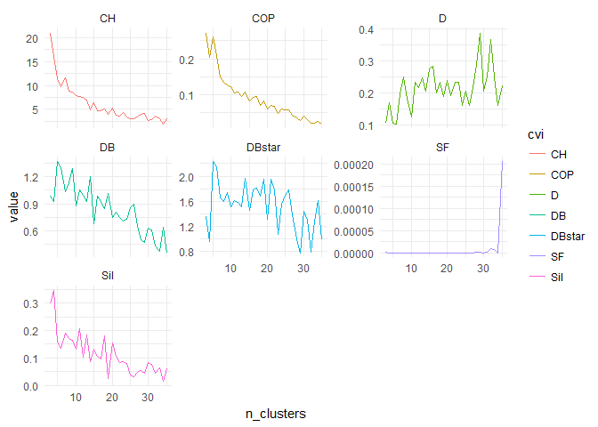

The cluster validity indices don't show a strong signal of what the best number of clusters is for these data. We will go with five, since that seems to be indicated by D, COP, and CH. Here's the cluster analysis with 5 clusters:

``` r
pc <- tsclust(kbp2013_2017_props_per_year_split_num, 
                            type = "partitional", k = 5, 
              distance = "dtw_basic", centroid = "pam", 
              seed = 3247L, trace = TRUE,
              args = tsclust_args(dist = list(window.size = 5)))
#> 
#>  Precomputing distance matrix...
#> 
#> Iteration 1: Changes / Distsum = 40 / 225.0367
#> Iteration 2: Changes / Distsum = 5 / 200.8561
#> Iteration 3: Changes / Distsum = 0 / 199.3533
#> 
#>  Elapsed time is 0.25 seconds.
plot(pc)
```

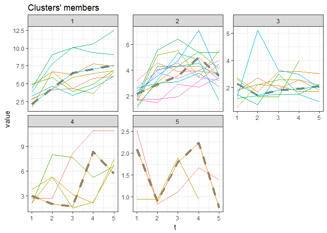

The plot shows the obtained clusters and their respective prototypes (centroids) are shown as dashed lines. The first two clusters are the largest, and the centroids for these show two change points, for cluster one it's at 3 and cluster two it's at 4. So that suggests to us that for the states in clusters one and two, something happened in 2015 and 2016.

Here are the states in cluster one:

``` r
states_in_clusters <- 
    data_frame(cluster = pc@cluster,
                       state = names(kbp2013_2017_props_per_year_split)) %>% 
    arrange(cluster)

states_in_clusters %>% 
    filter(cluster == 1) %>% 
    pull()
#> [1] "AL" "AZ" "CO" "MS" "MT" "NM" "OK" "WA" "WV"
```

And these are the states in cluster two:

``` r
states_in_clusters %>% 
    filter(cluster == 2) %>% 
    pull()
#>  [1] "FL" "HI" "ID" "KS" "KY" "LA" "NC" "NE" "OR" "SD" "TN" "TX" "VA" "WI"
```

A follow-up to this analysis might look into the activities of the state legislatures in 2015 and 2016 that might be responsible for the change points that we see in the cluster centroids. Analysis of the states in cluster two in 2016 would be particulately interesting as that may reveal changes that could help to reduce people killed by police in other states.

Related work
------------

There are several Python scripts for scraping killedbypolice.net, for example by [markberger](https://github.com/markberger/police-killings-dataset) and [AceLewis](https://github.com/AceLewis/killedbypolice), and a Ruby script by [atom-morgan](https://github.com/atom-morgan/killed-by-police). We have not tried any of these, or used them here.

There are several other major projects with similar data:

-   [Mapping Police Violence](https://mappingpoliceviolence.org/) contains data on people killed by police since 2013. They aggregate data from [*Fatal Encounters*](http://www.fatalencounters.org/), killedbypolice.net, and the [U.S. Police Shootings Database](https://docs.google.com/spreadsheets/d/1cEGQ3eAFKpFBVq1k2mZIy5mBPxC6nBTJHzuSWtZQSVw/edit). They include data about whether the deceased was armed or not, and if a vehicle was involved, how it contributed to the death. The site features numerous visualisations exploring the data, especially the representation of Black people, and includes some interactive visualisations.
-   [*Fatal Encounters*](http://www.fatalencounters.org/) is a database of all deaths through police interaction in the United States since 1 Jan 2000. It is a public [Google spreadsheet](https://docs.google.com/spreadsheets/d/1dKmaV_JiWcG8XBoRgP8b4e9Eopkpgt7FL7nyspvzAsE/edit#gid=0). It contains variables not inlcuded in killedbypolice, such as street addresses and history of mental illness. Data are tweeted at [@fatalencounters](https://twitter.com/fatalencounters) and [@the\_decedents](https://twitter.com/the_decedents). They are still updating their data. It has been used by [Snopes.com](https://www.snopes.com/do-police-kill-more-whites-than-black-people/).
-   *The Washington Post* started compiling data on fatal shootings by U.S. police in 2015. Their data are available in CSV files at their [Washington Post GitHub repository](https://github.com/washingtonpost/data-police-shootings). They are still updating their data, and it includes some variables not collected by the killedbypolice, such as whether or not the deceased was armed, and what city the event occured in. These data have also been used by [Buzzfeed](https://github.com/BuzzFeedNews/2015-12-fatal-police-shootings).
-   *The Guardian* collected data on on fatal shootings by U.S. police in 2015-2016 for their project [The Counted](https://www.theguardian.com/us-news/ng-interactive/2015/jun/01/the-counted-police-killings-us-database). They are no longer updating this project. These data have been used by [FiveThirtyEight](https://github.com/fivethirtyeight/data/tree/master/police-killings) and [Buzzfeed](https://github.com/BuzzFeedNews/2015-12-fatal-police-shootings) and projects on GitHub, e.g. [flother](https://github.com/flother/thecounted), and [Kaggle](https://www.kaggle.com/the-guardian/the-counted).
-   [VICE News](https://news.vice.com/en_us/article/xwvv3a/shot-by-cops) examined both fatal and nonfatal incidents from 2010 through 2016. The data are on [GitHub](https://github.com/vicenews/shot-by-cops/) and in a [Google Sheet](https://docs.google.com/spreadsheets/d/1CaOQ7FUYsGFCHEqGzA2hlfj69sx3GE9GoJ40OcqI9KY/edit#gid=1271324584)
-   [Wikipedia](https://en.wikipedia.org/wiki/List_of_killings_by_law_enforcement_officers_in_the_United_States) has lists of killings by law enforcement offiers in the US, but the numbers are much lower than any of the other sources noted here.

Contributing
------------

Please note that this project is released with a [Contributor Code of Conduct](CONDUCT.md). By participating in this project you agree to abide by its terms.
