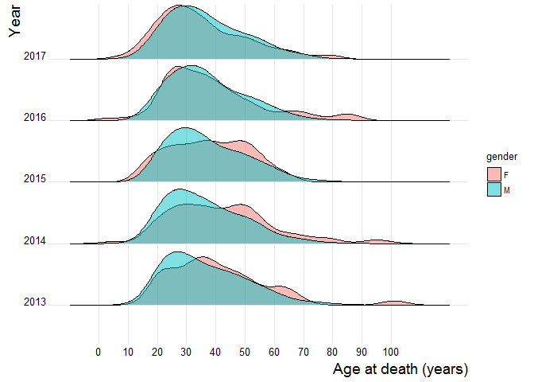
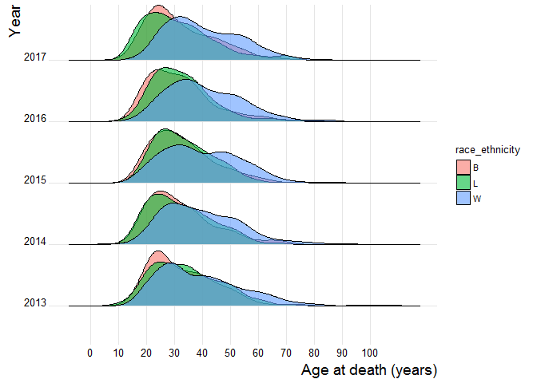
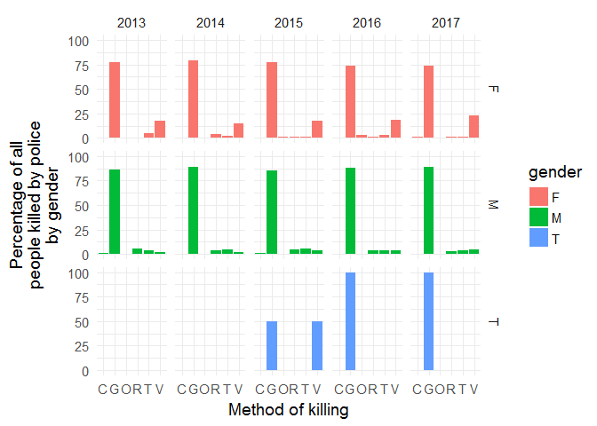
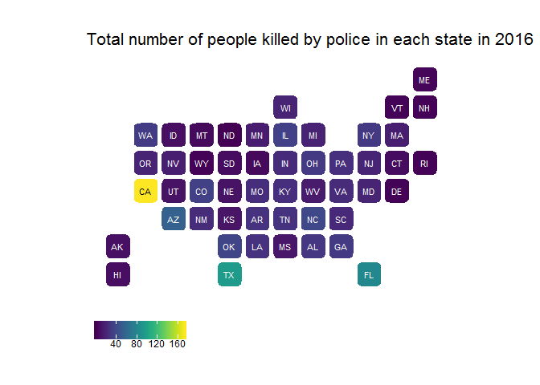
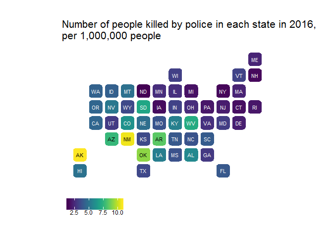
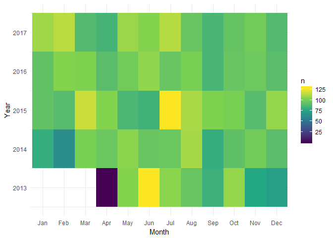

<!-- README.md is generated from README.Rmd. Please edit that file -->
killedbypolice
==============

<!--
[](https://github.com/benmarwick/killedbypolice/commits/master)  
[](https://travis-ci.org/benmarwick/killedbypolice)   [](https://img.shields.io/badge/lifecycle-experimental-orange.svg)
-->
The goal of killedbypolice is to make readily available the data collected by <http://killedbypolice.net/> for exploration, visualisation, and analysis.

We don't know much about who collects the data for <http://killedbypolice.net/>, or what their methods are. [FiveThirtyEight](https://fivethirtyeight.com/features/another-much-higher-count-of-police-homicides/) reported that he was 'an instructor on nonviolent physical-intervention techniques and that he prefers to remain anonymous'.

This is an important data set because the 'US government has no comprehensive record of the number of people killed by law enforcement.' ([*The Guardian*, 1 June 2015](https://www.theguardian.com/us-news/ng-interactive/2015/jun/01/about-the-counted)). The killedbypolice project is one of a few non-government projects that continuously collect data on police killings (see [Related work](#related-work) below).

Installation
------------

You can install killedbypolice from github with:

``` r
# install.packages("devtools")
devtools::install_github("benmarwick/killedbypolice")
```

How to use
----------

This is a basic example which shows you how to access the data in this package:

``` r
# load the library
library(killedbypolice)

# load the data frame, ready to work with 
data("kbp2013_2017")
```

Here are some ways we can take a look at the structure of the data:

``` r
# inspect the data
suppressPackageStartupMessages(library(dplyr))
glimpse(kbp2013_2017)
#> Observations: 5,578
#> Variables: 14
#> $ event_date     <date> 2013-12-31, 2013-12-31, 2013-12-31, 2013-12-30...
#> $ state          <chr> "WA", "CA", "NC", "PA", "CA", "CO", "CA", "LA",...
#> $ name           <chr> "James M. Eshelman", "Dontae Hayes", "Ricky Jun...
#> $ age            <dbl> 54, 20, 34, 43, 31, 43, 45, 22, 30, 51, 37, 40,...
#> $ gender         <chr> "M", "M", "M", "M", "F", "M", "M", "M", "M", "M...
#> $ race_ethnicity <chr> NA, "B", "B", "B", "W", "W", "O", NA, "W", "W",...
#> $ method_1       <chr> "G", "G", "G", "G", "G", "G", "G", "G", "G", "G...
#> $ method_2       <chr> NA, NA, NA, NA, NA, NA, NA, NA, NA, NA, NA, NA,...
#> $ method_3       <chr> NA, NA, NA, NA, NA, NA, NA, NA, NA, NA, NA, NA,...
#> $ method_4       <chr> NA, NA, NA, NA, NA, NA, NA, NA, NA, NA, NA, NA,...
#> $ method_5       <chr> NA, NA, NA, NA, NA, NA, NA, NA, NA, NA, NA, NA,...
#> $ event_year     <dbl> 2013, 2013, 2013, 2013, 2013, 2013, 2013, 2013,...
#> $ event_month    <dbl> 12, 12, 12, 12, 12, 12, 12, 12, 12, 12, 12, 12,...
#> $ event_day      <int> 31, 31, 31, 30, 30, 29, 29, 29, 29, 29, 28, 28,...

head(kbp2013_2017)
#> # A tibble: 6 x 14
#>   event_date state name     age gender race~ meth~ meth~ meth~ meth~ meth~
#>   <date>     <chr> <chr>  <dbl> <chr>  <chr> <chr> <chr> <chr> <chr> <chr>
#> 1 2013-12-31 WA    James~  54.0 M      <NA>  G     <NA>  <NA>  <NA>  <NA> 
#> 2 2013-12-31 CA    Donta~  20.0 M      B     G     <NA>  <NA>  <NA>  <NA> 
#> 3 2013-12-31 NC    Ricky~  34.0 M      B     G     <NA>  <NA>  <NA>  <NA> 
#> 4 2013-12-30 PA    Willi~  43.0 M      B     G     <NA>  <NA>  <NA>  <NA> 
#> 5 2013-12-30 CA    Betha~  31.0 F      W     G     <NA>  <NA>  <NA>  <NA> 
#> 6 2013-12-29 CO    Chris~  43.0 M      W     G     <NA>  <NA>  <NA>  <NA> 
#> # ... with 3 more variables: event_year <dbl>, event_month <dbl>,
#> #   event_day <int>
```

Some explorations
-----------------

Here are some explorations of the data:

The most common age to be killed by police is the in the late twenties and early thirties, and this has not changed much over time.

``` r
library(ggplot2)
library(ggridges)

kbp2013_2017 %>% 
  filter(gender %in% c("F", "M", "T")) %>% 
  filter(!is.na(event_year)) %>% 
  ggplot(aes(x = age,
             y = factor(event_year),
             fill = gender)) +
  geom_density_ridges(alpha = 0.5, 
                      scale = 0.9)  +
  theme_ridges(font_size = 10) +
  scale_x_continuous(breaks = seq(0, 100, 10),
                     labels = seq(0, 100, 10)) +
  xlab("Age at death (years)") +
  ylab("Year") +
  theme(axis.title = element_text(size = 14))
#> Picking joint bandwidth of 4.28
#> Warning: Removed 108 rows containing non-finite values
#> (stat_density_ridges).
```



Of the three ethnic groups that make up most of the deaths, black and Latino people tend to be younger than white people when they are killed by police.

``` r
kbp2013_2017 %>% 
  filter(race_ethnicity %in% c("B", "W", "L")) %>% 
  filter(!is.na(event_year)) %>% 
  ggplot(aes(x = age,
             y = factor(event_year),
             fill = race_ethnicity)) +
  geom_density_ridges(alpha = 0.6, 
                      scale = 0.9)  +
  theme_ridges(font_size = 10) +
  scale_x_continuous(breaks = seq(0, 100, 10),
                     labels = seq(0, 100, 10)) +
  xlab("Age at death (years)") +
  ylab("Year") +
  theme(axis.title = element_text(size = 14))
#> Picking joint bandwidth of 3.58
#> Warning: Removed 46 rows containing non-finite values
#> (stat_density_ridges).
```



By far the most common way that people are killed by police is with a gun. Deaths by vehicle involve women more often than men.

``` r
kbp2013_2017 %>% 
  filter(!is.na(event_year)) %>% 
  filter(method_1 != "NA") %>% 
  filter(gender %in% c("M", "F", "T")) %>% 
  group_by(event_year, 
           gender,
           method_1) %>% 
  tally() %>% 
  mutate(perc = n / sum(n) * 100)  %>% 
  ggplot(aes(method_1,
             perc,
             fill = gender)) +
  geom_col() +
  facet_grid(gender~event_year) +
  theme_minimal(base_size = 14) +
  xlab("Method of killing") +
  ylab("Percentage of all\npeople killed by police\nby gender") 
```



In 2016, the state with the largest number of people killed by police was California.

``` r
library(statebins) # using GitHub version
library(viridis)
#> Loading required package: viridisLite

# we need to convert state abbreviations to state names for the statebins function
state_abb <- data_frame(state_name = state.name,
                        state_abb = state.abb)

# we need to add the state popluations so we can get a proportion of people in each state
# we got this from https://www2.census.gov/programs-surveys/popest/tables/2010-2016/state/totals/nst-est2016-01.xlsx
state_populations <- readr::read_csv("data-raw/nst-est2016-01.csv")
#> Parsed with column specification:
#> cols(
#>   X1 = col_integer(),
#>   X__1 = col_character(),
#>   Census = col_integer(),
#>   `Estimates Base` = col_integer(),
#>   `2010` = col_integer(),
#>   `2011` = col_integer(),
#>   `2012` = col_integer(),
#>   `2013` = col_integer(),
#>   `2014` = col_integer(),
#>   `2015` = col_integer(),
#>   `2016` = col_integer()
#> )

# clean it a little
state_populations <-  
  state_populations %>% 
  mutate(state_name = gsub("\\.", "", X__1)) %>%
  left_join(state_abb)
#> Joining, by = "state_name"

# compute deaths by state and as deaths per 1000 people in each state
by_state <- kbp2013_2017 %>% 
  filter(event_year == 2016) %>% 
  group_by(state) %>% 
  tally() %>% 
  left_join(state_abb, by = c('state' = 'state_abb')) %>% 
  filter(!is.na(state_name)) %>% 
  left_join(state_populations) %>% 
  mutate(per_n_people = (n / `2016`) * 1000000)
#> Joining, by = "state_name"

# plot 'statebin' style map
ggplot(by_state, 
       aes(state = state_name, 
           fill = n)) +
  geom_statebins() +
  coord_equal() +
  scale_fill_viridis() +
  theme_statebins() +
  labs(title = "Total number of people killed by police in each state in 2016") +
  theme(legend.title=element_blank()) 
```



But when we consider the differences in the number of people in each state, New Mexico and Alaska have the highest proportions of people killed by police.

``` r
ggplot(by_state, 
       aes(state = state_name, 
           fill = per_n_people)) +
  geom_statebins() +
  coord_equal() +
  scale_fill_viridis() +
  theme_statebins() +
  labs(title = "Number of people killed by police in each state in 2016,\nper 1,000,000 people")  +
  theme(legend.title=element_blank()) 
```



There does not appear to any obvious seasonality to police killings. June 2013 and July 2015 were especially bad months.

``` r
kbp2013_2017 %>% 
  filter(!is.na(event_month)) %>% 
  group_by(event_month, 
           event_year) %>% 
  tally() %>% 
  mutate(month_name = month.abb[event_month]) %>% 
  mutate(month_name = factor(month_name, levels = month.abb)) %>% 
ggplot() +
  geom_tile(aes(x = month_name, 
                y = event_year, 
                fill = n)) +
  scale_fill_viridis_c() +
  theme_minimal() +
  xlab("Month") +
  ylab("Year")
```



Related work
------------

There are several Python scripts for scraping killedbypolice.net, for example by [markberger](https://github.com/markberger/police-killings-dataset) and [AceLewis](https://github.com/AceLewis/killedbypolice), and a Ruby script by [atom-morgan](https://github.com/atom-morgan/killed-by-police). We have not tried any of these, or used them here.

There are several other major projects with similar data:

-   [Mapping Police Violence](https://mappingpoliceviolence.org/) contains data on people killed by police since 2013. They aggregate data from [*Fatal Encounters*](http://www.fatalencounters.org/), killedbypolice.net, and the [U.S. Police Shootings Database](https://docs.google.com/spreadsheets/d/1cEGQ3eAFKpFBVq1k2mZIy5mBPxC6nBTJHzuSWtZQSVw/edit). They include data about whether the deceased was armed or not, and if a vehicle was involved, how it contributed to the death. The site features numerous visualisations exploring the data, especially the representation of Black people, and includes some interactive visualisations.
-   [*Fatal Encounters*](http://www.fatalencounters.org/) is a database of all deaths through police interaction in the United States since 1 Jan 2000. It is a public [Google spreadsheet](https://docs.google.com/spreadsheets/d/1dKmaV_JiWcG8XBoRgP8b4e9Eopkpgt7FL7nyspvzAsE/edit#gid=0). It contains variables not inlcuded in killedbypolice, such as street addresses and history of mental illness. Data are tweeted at [@fatalencounters](https://twitter.com/fatalencounters) and [@the\_decedents](https://twitter.com/the_decedents). They are still updating their data. It has been used by [Snopes.com](https://www.snopes.com/do-police-kill-more-whites-than-black-people/).
-   *The Washington Post* started compiling data on fatal shootings by U.S. police in 2015. Their data are available in CSV files at their [Washington Post GitHub repository](https://github.com/washingtonpost/data-police-shootings). They are still updating their data, and it includes some variables not collected by the killedbypolice, such as whether or not the deceased was armed, and what city the event occured in. These data have also been used by [Buzzfeed](https://github.com/BuzzFeedNews/2015-12-fatal-police-shootings).
-   *The Guardian* collected data on on fatal shootings by U.S. police in 2015-2016 for their project [The Counted](https://www.theguardian.com/us-news/ng-interactive/2015/jun/01/the-counted-police-killings-us-database). They are no longer updating this project. These data have been used by [FiveThirtyEight](https://github.com/fivethirtyeight/data/tree/master/police-killings) and [Buzzfeed](https://github.com/BuzzFeedNews/2015-12-fatal-police-shootings) and projects on GitHub, e.g. [flother](https://github.com/flother/thecounted), and [Kaggle](https://www.kaggle.com/the-guardian/the-counted).
-   [VICE News](https://news.vice.com/en_us/article/xwvv3a/shot-by-cops) examined both fatal and nonfatal incidents from 2010 through 2016. The data are on [GitHub](https://github.com/vicenews/shot-by-cops/) and in a [Google Sheet](https://docs.google.com/spreadsheets/d/1CaOQ7FUYsGFCHEqGzA2hlfj69sx3GE9GoJ40OcqI9KY/edit#gid=1271324584)
-   [Wikipedia](https://en.wikipedia.org/wiki/List_of_killings_by_law_enforcement_officers_in_the_United_States) has lists of killings by law enforcement offiers in the US, but the numbers are much lower than any of the other sources noted here.

Contributing
------------

Please note that this project is released with a [Contributor Code of Conduct](CONDUCT.md). By participating in this project you agree to abide by its terms.
